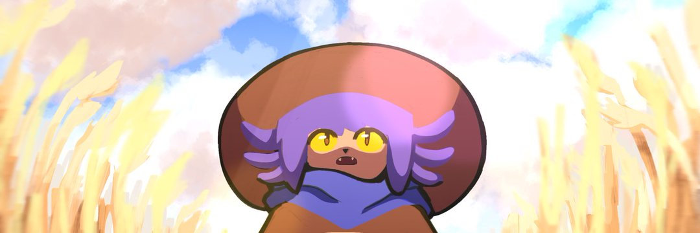

<h2>
    
</h2>

Projects:

- [yarw](https://github.com/yarwhq/yarw)
- [uuidtools](https://github.com/yarwhq/uuidtools)

<h2>Knowledge:</h2> 

  
  
  
  
  
  
  <a href="https://www.rust-lang.org/" target="_blank" rel="noreferrer">
    

